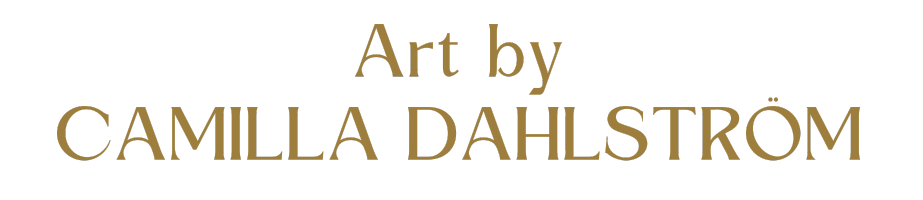

`python3 -m http.server`

This is under construction.
Live: https://camdah77.github.io/artist_sample/

Sample of Artist homepage
Small

Medium

Large

## Tabel of contents
+ [UX](#ux "UX")
  + [Site Purpose](#site-purpose "Site Purpose")
  + [Site Goal](#site-goal "Site Goal")
  + [Business Strategy](#business-strategy "Business Strategy")
  + [Target Market](#target-market "Target Market")
  + [Communication](#communication "Communication")
  + [Design](#design "Design")
  + [Wireframe](#wireframe "Wireframe")
  + [Colour Scheme](#colour-scheme "Colour Scheme")
  + [Typography](#typography "Typography")
  + [Imagery](#imagery "Imagery")
+ [Features](#features "Features")
  + [Existing Features](#existing-features "Existing Features")
+ [Testing](#testing "Testing")
  + [Validator Testing](#validator-testing "Validator Testing")
  + [Unfixed Bugs](#unfixed-bugs "Unfixed Bugs")
+ [Technologies Used](#technologies-used "Technologies Used")
  + [Main Languages Used](#main-languages-used "Main Languages Used")
  + [Frameworks, Libraries & Programs Used](#frameworks-libraries-programs-used "Frameworks, Libraries & Programs Used")
+ [Deployment](#deployment "Deployment")
+ [Credits](#credits "Credits")
  + [Content](#content "Content")

  ## UX

### Site Purpose: